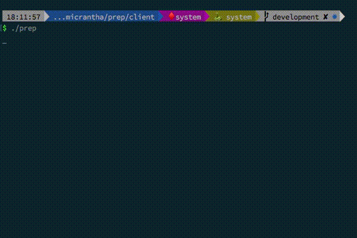

Prep
====

Prep is a modular package manager and build tool for c/c++ projects.

In inception style, the core is written in C++, but the majority of the work is done by plugins.

Its main benefits are:

* Plugin architecture for extendability to resolving and building packages.  Plugins can be configured in projects and support user interaction.

* You don't need a dedicated repository or configuration for packages. Configure your project's dependency to a git repo, archive url or anything that a resolver plugin supports.

* It will work with any package's build system via plugins and configuration.  Build time and Runtime paths and flags are managed.  

* CMake integration for use in IDEs (TODO: document)


I don't really have a lot time to maintain this project (SEE TODO), so I'm releasing to open source in the hopes it will be interesting to others.



Installing
==========

#### Debian/Ubuntu

[Download a package from the release section](https://github.com/ryjen/prep/releases/download/v0.1.0/prep-0.1.0.deb) and run `dpkg -i prep-<version>.deb`

#### [Homebrew](https://brew.sh)/[Linuxbrew](https://linuxbrew.sh) 

`brew tap ryjen/tap`

`brew install prep`


Commands
========

`prep` or `prep get`
  - install dependencies into the local repository.

`prep build`
  - build current project.

`prep install`
  - installs the current project in the local repository for execution
  
`prep build -fv`
  - rebuild everything including dependencies and be verbose

`prep cleanup`
  - removes build files and other intermediates
 
`prep plugins`
  - shows the help message of the plugin manager

`prep test`
  - tests a project
  
Plugins
=======

Plugins can be written in **any language that supports stdin/stdout** using the following "crap point oh" version of a specification for communication. 

The plugins are forked to run in a seperate pseudo terminal, allowing for user interaction should a plugin require it.

The default plugins and SDK is written in Go.  They are compiled, compressed, and included in a shared library.  When you initialize a repository for the first time, the shared library will be loaded and the default plugins extracted.

### Current default plugins:

- **archive**: a resolver plugin that downloads and extracts different archived formats
- **autotools**: a build plugin that uses a configure script to generate makefiles. requires a configure script
- **cmake**: a build plugin that uses cmake to generate makefiles
- **make**: a build plugin that executes make on a makefile.  requires install param
- **git**: a resolver plugin that clones a git repository
- **homebrew**: a resolver plugin that installs packages using homebrew on OSX
- **apt**: a resolver plugin that installs packages using apt on deb/ubuntu

## Plugin Types:

`dependency`

  - resolves system packages

`resolver`

  - resolves package files for building

`configuration`

  - build system plugin for configuring a build

`build`

  - build system plugin for compiling

`internal`

  - internal plugins are executed before any other plugin and cannot be specified in configuration.


## Plugin Hooks:

When writing a plugin, you have several **hooks** that will be sent over stdin.  Depending on what you need to do you can react to one or more of them.

`LOAD`

  - Occurs when a plugin is loaded for custom initialization

`UNLOAD`

  - Occurs when a plugin is unloaded for custom cleanup

`ADD`

  - Occurs when a dependency wants to be installed.  Only affects plugins of type "resolver".
  - Parameters: [`package`, `version`]

`REMOVE`

  - Occurs when a dependency wants to be removed.  Only affects plugins of type "resolver".
  - Parameters: [`package`, `version`]

`BUILD`

  - Occurs when a package wants to be built. Only affects plugins of type "build" and "configuration".
  - Parameters: [`package`, `version`, `sourcePath`, `buildPath`, `installPath`, `buildOpts`, `envVar=value...`]

`TEST`

  - Occurs when a package wants to be tested. Only affects plugins of type "build".
  - Parameters: [`package`, `version`, `sourcePath`, `buildPath`, `envVar=value...`]

`INSTALL`

  - Occurs when a package wants to be installed. Only affects plugins of type "build".
  - Parameters: [`package`, `version`, `sourcePath`, `buildPath`, `envVar=value...`]


## Plugin input header:

A plugin will always recieve a header on stdin:

```
<required hook>\n
<optional hook parameter>\n
<optional hook parameter>\n
END\n
```

## Plugin commands:

A plugin may send a command over stdout:


`RETURN`

Specifies one or more return values.

```
RETURN <value>\n
```


`ECHO`

Relays a message to prep, regardless of verbosity level.

```
ECHO <message>\n
```


Any other **output** by the plugin is forwarded to prep's output when in **verbose mode**.

## Current default plugins:

- **archive**: a resolver plugin that downloads and extracts different archived formats
- **autotools**: a build plugin that uses a configure script to generate makefiles. requires a configure script
- **cmake**: a build plugin that uses cmake to generate makefiles
- **git**: a resolver plugin that clones a git repository
- **homebrew**: a resolver plugin that installs packages using homebrew on OSX
- **make**: a build plugin that executes make on a makefile.  requires install param
- **apt**: a resolver plugin that installs packages using apt on debian/ubuntu

## Plugin manifest:

Plugins should contain a **manifest.json** to describe the type of plugin and how to run.

```JSON
{
    "executable": "main",
    "version": "0.1.0",
    "type": "resolver"
}
```

Repository Structure
====================

A repository by default is a `.prep` folder in the current directory.  Similar to node you can specify a **-g** option to use **/usr/local/share/prep** instead.

The repository holds all the dependencies and mimics a system install hierarchy.

Dependencies installed via the system package manager will get a reciept in the repository.

Under the repository:

`/plugins`
  - holds all plugins

`/kitchen`
  - holds all file related to builds

`/kitchen/meta`
  - holds the version and package information

`/kitchen/install`
  - holds a directory for each package installation files

`/kitchen/build`
  - a separate directory for compiling

packages in **/kitchen/install** are symlinked to **bin**, **lib**, **include** (etc) inside the repository and reused by prep.  You can add the repository to your path with ```prep env```  (TODO: Clarify, improve and test this more)


Configuration
=============

The configuration was also inspired by node. A project is simple a **package.json** file containing the json.  The fields are as follows:

`name`
  - the name of the project as a string

`version`
  - the version of the project as a string

`build_system`
  - an array of strings identifying build plugins that define how to make a build.  So if your project uses cmake, you would define **cmake**, then **make**.  the plugins are executed in the order of specified.

`build_options`
  - an array of strings to pass directly to the build system.  You have the option of using environment variables or compiler switches.

`executable`
  - the name of the executable or library to build as a string

`dependencies`
  - an array of this configuration type defining each dependency.  Dependencies will be resolved using **resolver** plugins in the order specified. Dependencies can also have dependencies. 

`<plugin>`
  - A plugin can define its own options to override.  For example if the **homebrew** plugin has a different name for the dependency you can specify it like:


```JSON
"dependencies": [
  {
    "name": "somelib",
    "homebrew": {
        "name": "altlibname"
    }
  }
],
```

### Example configuration:
This is what a configuration from another project looks like:

```JSON
{
    "name": "yahtsee",
    "version": "1.0",
    "executable": "yahtsee",
    "author": {
        "email": "ryan@micrantha.com",
        "name": "Ryan Jennings"
    },
    "build_system": ["cmake", "make"],
    "dependencies": [
        {
            "name": "nljson",
            "version": "2.1.1",
            "build_system": ["cmake", "make"],
            "git": {
                "location": "https://github.com/nlohmann/json.git#v2.1.1"
            }
        },
        {
            "name": "fruit",
            "version": "3.1.1",
            "build_system": ["cmake", "make"],
            "git": {
                "location": "https://github.com/google/fruit.git#v3.1.1"
            }
        },
        {
            "name": "libcoda",
            "version": "0.5.0",
            "build_system": ["cmake", "make"],
            "git": {
                "location": "https://github.com/ryjen/libcoda.git#development"
            }
        },
        {
            "name": "uriparser",
            "version": "0.8.4",
            "build_system": ["autotools", "make"],
            "git": {
                "location": "git://git.code.sf.net/p/uriparser/git#uriparser-0.8.4"
            }
        },
        {
            "name": "rxcpp",
            "version": "4.0.0",
            "build_system": ["cmake", "make"],
            "git": {
                "location": "https://github.com/Reactive-Extensions/RxCpp.git#v4.0.0"
            }
        },
        {
            "name": "imgui",
            "version": "1.5.3",
            "build_system": ["cmake", "make"],
            "git": {
                "location": "https://github.com/ryjen/imgui-cmake.git#v1.5.3"
            }
        }
    ]
}
```


TODO
====
- [ ] ability to distinguish build types for a project (debug/release)
- [ ] store md5 hash of configs in meta to detect project changes
- [ ] website/api for plugins and docs
- [x] move default plugins to dynamically loaded shared library to save memory
- [ ] more security on plugins (enforce digital signature?, chroot to prep repository?)
- [ ] a way to install new plugins and/or plugin management
- [x] parse archive versions from filename
- [x] store config subset of package.json in meta for dependencies for single use commands
- [x] a way to rebuild a dependency or all dependencies
- [ ] dependencies will be better as a tree rather than a list
- [ ] consider sqlite storage
- [ ] complete test suite
- [x] convert plugins to compiled language
- [x] repository cleanup (builds, old versions, etc)
- [ ] clion/intellij plugin
- [x] CMake integration
- [ ] ability for plugins to add commands to prep
- [ ] plugin sdks for different languages
- [ ] package.json in subdirectory support (recursive)
- [ ] a strategy to lose dependency on 'prep run' (`prep install system`?)
- [ ] make workflow video showing usage with vim
- [ ] posix complient version? (no pty?)

Building
========

Should be pretty self explanitory!

1. `git submodule update --init --recursive` 
2. `mkdir build; cd build`
3. `cmake ..`
4. `make`

#### Debian/Ubuntu packaging

To build a debian package:

1. define `CMAKE_INSTALL_PREFIX=<srcdir>/package/usr/local` using cmake
2. run `make install`
3. run `dpkg-deb -b <srcdir>/package prep-<version>.deb`


Contributing
============

Create an issue/feature, fork, build, send pull request.  Upon approval add your name to AUTHORS.
Also looking for maintainers, start a conversation.

