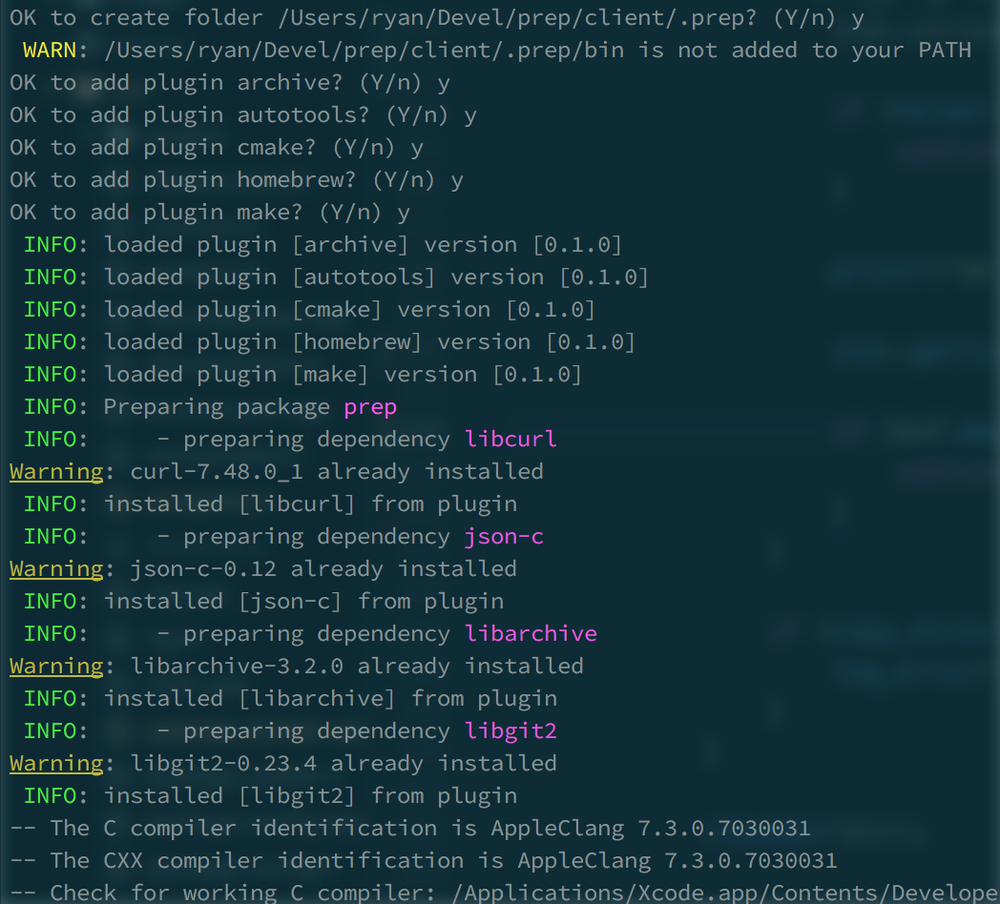

prep
====

Prep is a modular package manager for c/c++ (think npm for c++).  Plugins are used for dependency management and builds.

plugins
=======

Plugins can be written in any language that supports stdin/stdout. Input parameters are read one line at a time on stdin.  All output is forwarded back to prep.  

There are the following plugin hooks:

### load

occurs when a plugin is loaded for custom initialization

### unload

occurs when a plugin is unloaded for custom cleanup

### install

occurs when a dependency is installed.  Only affects plugins of type "dependency".

parameters: [**package, version**]

### remove

occurs when a dependency is removed.  Only affects plugins of type "dependency".

parameters: [**package, version**]

### build

occurs when a package is built. Only affects plugins of type "build".

parameters: [**package, version, sourcePath, buildPath, installPath, buildOpts, envVar=value... END**]

features
========
- npm style repositories (current directory or global)
- cmake, autoconf and make build plugins included
- archive and homebrew package manager plugins included
- simple json configuration

TODO
====
- package repository website/api (ipfs?)
- parse archive versions from filename
- store md5 hash of config in meta to detect changes
- a way to rebuild a dependency or all dependencies
- a way to rebuild a package
- secure plugins (enforce digital signature?, chroot?)

repository structure
====================

A repository by default is a **.prep** folder in the current directory.  By specifying the **-g** option, **/usr/local/share/prep** will be used instead.

Under the repository:

**/plugins** : holds all plugins

**/kitchen** : holds all file related to builds

**/kitchen/meta** : holds the version and package information

**/kitchen/install** : holds a directory for each package installation files

**/kitchen/build** : a separate directory for compiling

packages in **/kitchen/install** are symlinked to **bin**, **lib**, **include**, etc.


example configuration
=====================

Examples explain best.  This is prep's configuration to build itself:

```JSON
{
	"name": "prep",
	"version": 1.0,
	"author": {
		"name": "Ryan Jennings",
		"email": "c0der78@gmail.com"
	},
	"build_system": ["cmake", "make"],
	"executable": "prep",
	"dependencies": [
		{
			"name": "libcurl",
			"homebrew": {
				"name": "curl"
			},
			"archive": {
				"location": "http://curl.haxx.se/download/curl-7.43.0.tar.bz2",
				"build_system": ["autotools", "make"],
				"build_options": "--without-libidn --without-ssl --enable-darwinssl --disable-ldap",
			},
			"dependencies": [
				{
					"name": "libz",
					"archive": {
						"location": "http://zlib.net/zlib-1.2.8.tar.gz",
						"build_system": ["cmake", "make"]
					}
				}
			]
		},
		{
			"name": "json-c",
			"git": {
				"location": "https://github.com/json-c/json-c.git",
				"build_system": ["autotools", "make"]
			}
		},
		{
			"name": "libarchive",
			"archive": {
				"location": "http://www.libarchive.org/downloads/libarchive-3.1.2.tar.gz",
				"build_system": ["autotools", "make"]
			},
			"dependencies": [
				{
					"name": "libxml2",
					"archive": {
						"location": "http://xmlsoft.org/sources/libxml2-2.9.2.tar.gz",
						"build_system": ["autotools", "make"],
						"build_options": "--without-python"
					}
				}
			]
		},
		{
			"name": "libgit2",
			"archive": {
				"location": "https://github.com/libgit2/libgit2/archive/v0.23.1.tar.gz",
				"build_system": ["cmake", "make"]
			}
		}
	]
}



```
