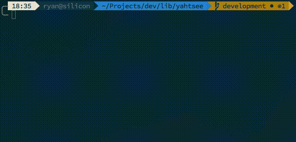

Prep
====

Prep is a modular package manager and build tool for c/c++ projects.  Yes, the core is written in C++ in the form of ```libutensil``` and ```prep``` binary, but the majority of the work is done by plugins.

**Prep will manage dependencies, paths and flags for building and running c/c++ projects.**

I no longer have time to maintain this project, so I'm releasing to open source.



Plugins
=======

Plugins can be written in **any language that supports stdin/stdout** using the following "crap point oh" version of a specification for communication. 

The plugins are forked to run in a seperate pseudo terminal. (See TODO for security)

The default plugins are currently written in Perl for prototyping purposes, so right now there is a dependency on perl.  Ideally, they'd be compiled when prep is built.


## plugin types:

#### resolver

resolves package locations

#### build

build system plugin for compiling

#### internal

Internal plugins are executed before any other plugin and cannot be specified in configuration.


## plugin hooks:

When writing a plugin, you have several **hooks** that will be sent over stdin.  Depending on what you need to do you can react to one or more of them.

#### LOAD

Occurs when a plugin is loaded for custom initialization

#### UNLOAD

Occurs when a plugin is unloaded for custom cleanup

#### INSTALL

Occurs when a dependency wants to be installed.  Only affects plugins of type "resolver".

parameters: [**package, version**]

#### REMOVE

Occurs when a dependency wants to be removed.  Only affects plugins of type "resolver".

parameters: [**package, version**]

#### BUILD

Occurs when a package wants to be built. Only affects plugins of type "build".

parameters: [**package, version, sourcePath, buildPath, installPath, buildOpts, envVar=value...**]


## plugin input header:

A plugin will always recieve a header on stdin:

```
<required hook>\n
<optional hook parameter>\n
<optional hook parameter>\n
END\n
```

## plugin output commands:

A plugin may send a command over stdout.


##### RETURN:

Specifies one or more return values.

```
RETURN <value>\n
```


##### ECHO:

Relays a message to prep, regardless of verbosity level.

```
ECHO <message>\n
```


Any other **output** by the plugin is forwarded to prep's output when in **verbose mode**.

## current plugins:

- **archive**: a resolver plugin that downloads and extracts different archived formats
- **autotools**: a build plugin that uses a configure script to generate makefiles
- **cmake**: a build plugin that uses cmake to generate makefiles
- **git**: a resolver plugin that clones a git repository
- **homebrew**: a resolver plugin that installs packages using homebrew on OSX
- **make**: a build plugin that executes make on a makefile

## plugin manifest:

Plugins should contain a **manifest.json** to describe the type of plugin and how to run.

```JSON
{
    "executable": "main",
    "version": "0.1.0",
    "type": "resolver"
}
```

Repository Structure
====================

A repository by default is a **.prep** folder in the current directory.  By specifying the **-g** option, **/usr/local/share/prep** will be used instead (Inspired by node).

Under the repository:

**/plugins** : holds all plugins

**/kitchen** : holds all file related to builds

**/kitchen/meta** : holds the version and package information

**/kitchen/install** : holds a directory for each package installation files

**/kitchen/build** : a separate directory for compiling

packages in **/kitchen/install** are symlinked to **bin**, **lib**, **include** (etc) inside the repository and reused by prep.  You can add the repository to your path with ```prep setpath```


Configuration
=============

The configuration for a project is simple a **package.json** file containing the json.  The fields are as follows:

#### name
the name of the project

#### version
the version of the project

#### build_system
an array of build plugins that define how to make a build.  So if your project uses cmake, you would define **cmake**, then **make**.  the plugins are executed in order of specification.

#### build_options
an array of options to pass directly to the build system.  You also have the option of using CXXFLAGS and LDFLAGS environment variables. (Might switch to RPATH, see TODO)

#### executable
the name of the executable or library to build

#### dependencies
an array of this configuration type objects defining each dependency.  Dependencies can be resolved using **resolver** plugins. Dependencies can also have dependencies. 

#### &lt;plugin&gt;
A plugin can define its own options to override.  For example if the **homebrew** plugin has a different name for the dependency you can specify it like:

```JSON
{
	"name": "somelib",
	"homebrew": {
		"name": "altlibname"
	}
}
```

### Example configuration:
This is what prep's configuration to build itself looks like:

```JSON
{
	"name": "prep",
	"version": "1.0",
	"author": {
		"name": "Ryan Jennings",
		"email": "ryan@micrantha.com"
	},
	"build_system": ["cmake", "make"],
	"executable": "prep",
	"dependencies": [
		{
			"name": "libarchive",
			"version": "3.1.2",
			"archive": {
				"location": "http://www.libarchive.org/downloads/libarchive-3.1.2.tar.gz",
				"build_system": ["autotools", "make"]
			},
			"dependencies": [
				{
					"name": "libxml2",
					"archive": {
						"location": "http://xmlsoft.org/sources/libxml2-2.9.2.tar.gz",
						"build_system": ["autotools", "make"],
						"build_options": "--without-python"
					}
				}
			]
		}
	]
}

```


TODO
====
- [ ] website/api for plugins and and configurations for common dependencies
- [ ] parse archive versions from filename
- [ ] store md5 hash of configs in meta to detect changes
- [ ] a way to rebuild a dependency or all dependencies
- [ ] secure plugins (enforce digital signature?, chroot?)
- [ ] a way to install new plugins
- [ ] consider RPATH flags
- [ ] dependencies might be better as a tree rather than a list
- [ ] consider sqlite storage
- [ ] test suite
- [ ] convert plugins to compiled language
- [ ] plugin communication will for sure need a better specification
- [ ] plugins may need to be interactive, currently not supported


Building
========

Just make sure you do a ```git submodule update --init --recursive``` and have libarchive and perl installed

Contributing
============

Create an issue/feature, fork, build, send pull request.  Upon approval add your name to AUTHORS.
Also looking for maintainers.

